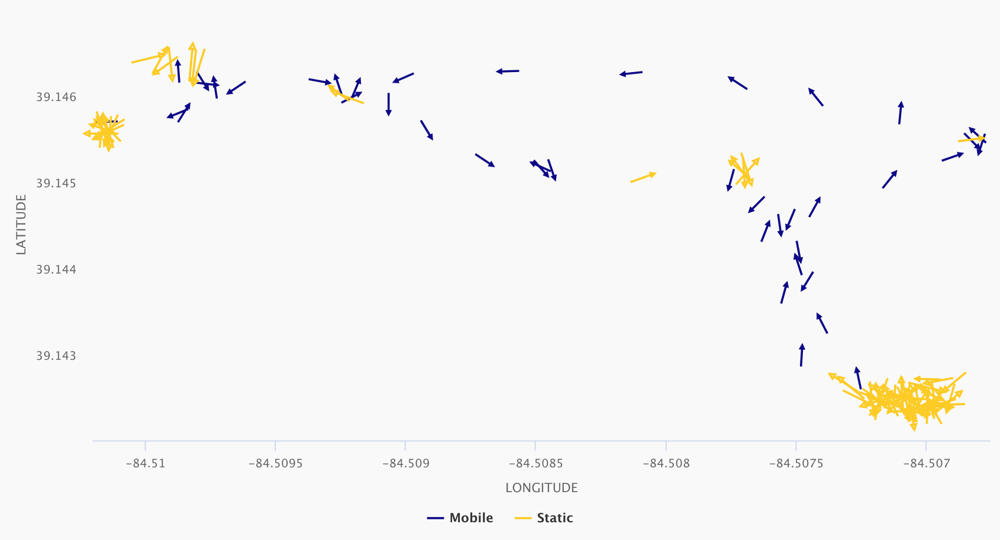

# circleclust

Circular or [directional statistics](https://en.wikipedia.org/wiki/Directional_statistics) is the study of directional or angular data.  Examples include data that is periodic in nature such as time (i.e. hours of the day, days of the year) and data that has no true zero such as compass bearing or wind direction. Circular statistics have been broadly applied across scientific disciplines. `circleclust` is most closely related to applications in movement ecology, or the movement of organisms.

`circleclust` is a collection of functions that facilitate the analysis of personal location data to decipher patterns in mobility.  The `circleclust::circleclust()` algorithm classifies coordinates into distinct spatiotemporal clusters based on circular variance, or the variability in the bearing between sequential points or [dihedral angles](https://en.wikipedia.org/wiki/Dihedral_angle).

## Examples

The algorithm calculates the circular variance within a moving window and classifies coordinates as either 'static' or 'mobile' based on departures from a threshold value.  The map below shows personal location data recorded while talking a stroll through the Cincinnati Zoo and Botanical Gardens.  Purple dots represent periods of mobile activity and yellow dots represent periods of static activity.


Plotting the bearing (azimuth) between sequential points gives an under the hood look at how the algorithm classifies coordinates. We see a higher degree of variability in the bearings classified as 'static', while the purple 'mobile' bearings demonstrate a consistent trajectory.

{width=848 height=464}

## Additional Features

`circleclust` also includes functions to aggregate data by time unit, impute missing location data, and spatial functions to transform and visualize clustered data.

## Installation

To install `circleclust`, use the following code:

``` r
install.packages("devtools")
devtools::install_github("wolfeclw/circleclust")
library(circleclust)
```
