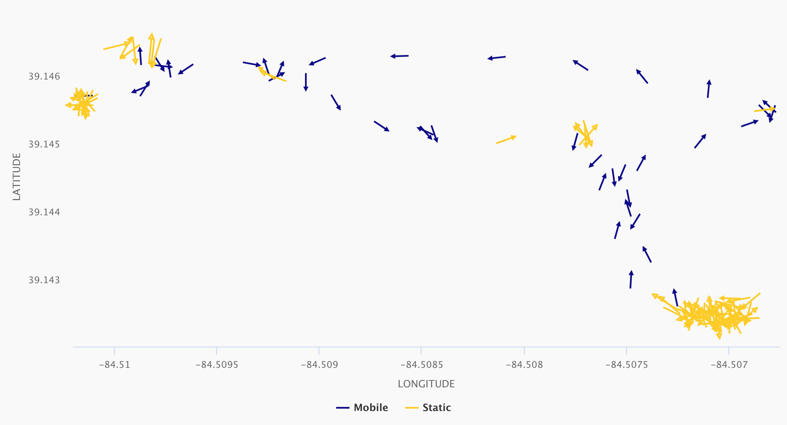

# Summary

Circular or directional statistics is the study of directional or angular data.  Examples include data that is periodic in nature such as time (i.e. hours of the day) and data that has no true zero such as compass bearing or wind direction. Circular statistics have been broadly applied across scientific disciplines. A common application  in biological science is movement ecology, or the movement of organisms. Our software package extends principles used in movement ecology to personal location monitoring in order to decipher patterns in human mobility.

`circleclust` is a collection of functions that facilitate the analysis of personal location data using R. The `circleclust()` algorithm detects changes in mobility based on the angular variability, or circular variance,  within a series of latitude and longitude coordinates.  Like the variance statistic in linear data, circular variance is a measure of dispersion but is bounded between 0 and 1 [@Dattatreya:2020].  A value of 0 indicates the sample directions (bearings) are uniform, while a value of 1 indicates a high degree of variability.  Our algorithm calculates circular variance within a moving window and classifies coordinates as either 'static' or 'mobile' based on departures from a user-defined threshold value.  Further, periods of static activity are categorized into distinct spatiotemporal clusters.  The `circleclust` package also includes functions to aggregate data by time unit, impute missing coordinates, transform location data into spatial objects, and visualize mobility patterns.

Plotting the bearings, as shown in \autoref{fig:1}, illustrates how the algorithm classifies location data as either mobile or belonging to a cluster.  Periods of transit (purple) exhibit a consistent trajectory, whereas periods of static activity (yellow) demonstrate a higher degree of variation.

# Statement of need

Advances in mobile technology and consumer-grade sensors have expanded the ability of researchers to conduct personal monitoring studies at a large scale.  `circleclust()` was developed to address this growing demand within environmental epidemiology. Specifically, we created our software to support the Ecological Momentary Assessment of Personal Particle Exposure project---an observational study investigating personal exposures to ultrafine particulate matter among adolescents in Cincinnati, OH.  Characterizing personal exposures by location and activity status is a critical step in untangling the complex relationship between personal behavior and exposure. This is especially true for pollutants with a high degree of spatial and temporal variation such as ultrafine particles. Understanding an individual's activity pattern allows pollutant exposures to be examined by 'microenvironment,' or a specific environment in which a person spends time and pollutant levels may vary (i.e. home, school, work, transit).

Common practice has been to use participant activity diaries and employed proximity and time-based rules to assign personal exposures by microenvironment [@Adams:2009]. However, time-activity diaries may place undue burden on research participants and may introduce bias into exposure assessment [@Nethery:2014]. Scrutinizing time-activity diaries to create participant-specific rules can place significant burden on the researcher as well. Limited studies have characterized personal exposures using novel techniques such as circular variance [@Donaire-Gonzales:2016].

Our goal was to develop a personal location algorithm to detect periods of mobile and static activity. And, we sought to further classify stationary measurements into separate spatiotemporal clusters that can then be mapped to individual microenviroments based on proximity. By using iteration functions such as those in the `purrr` package, our algorithm can be applied across participants and/or periods of data collection. This type of automated workflow will greatly reduce researcher burden. To our knowledge, this is the first publicly available software package to characterize mobility patterns in personal location data. Though `circleclust` was developed for a specific application in environmental epidemiology, our software could be applied in other fields of science.

# Acknowledgements

This project was funded under NIEHS grant R33ES024713.

# References
